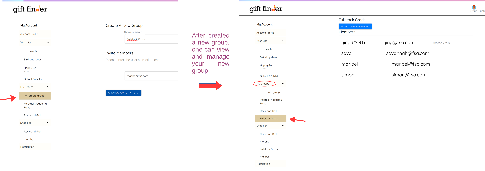
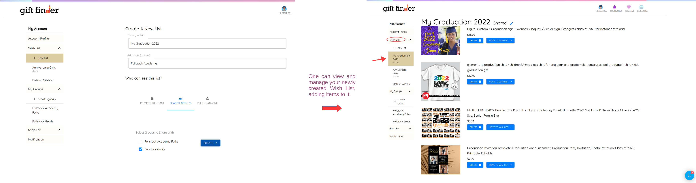
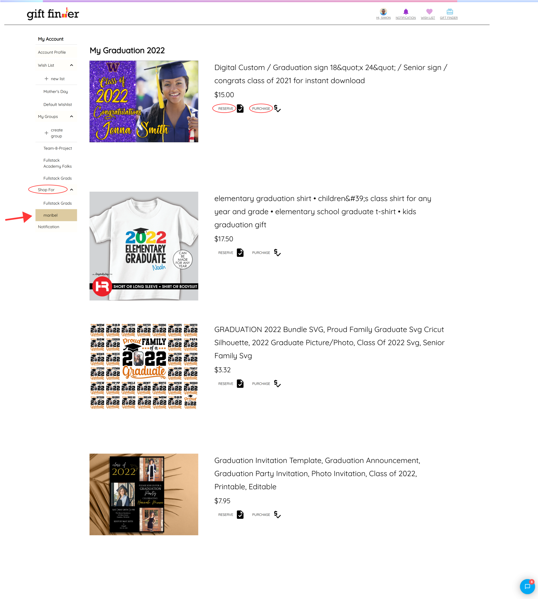
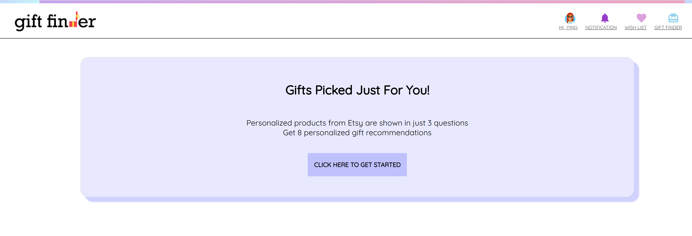

# GIFTFINDER

Have you ever bothered by searching for a perfect gift for your beloved ones. GiftFinder brings you a lot of ideas, inspirations and guides you with your preferences and categories.

You can view gifts falling into different cateogries (fetched from Etsy API). As a registered user, you are able to add any gift you like to your wish list. A user has a default wish list, she can also create new wish lists corresponding to different occasions (such as Birthday, Wedding, Graduation, Mother's Day etc). You could set these lists as Private, Shared, or Public. If it is private, only you can see it. If it is public, everyone on the internet can see it if they have the link.

A user can delete item from a list and can move the items to a different list she created.
You can also manually add an item to your wish list with external website links, name, images, price and description. All the gift items will show up in your list nicely.  

Best of all, You could share any of your wish lists to your friends by creating groups. Within your group, only the members that are within that group are able to view your shared lists.

A member within a group could mark a gift in your wishlist as reserved or purchased (under work) -- Every other member can see it, thus won't prepare a repeated gift for you for that occasion.

Members in the same group could communicate or messaging each other by a built-in chat widget, which makes discussion of purchasing a gift for someone much easier by sharing ideas or products that may directly found on our website.

What's more, it features a Personalized Questionnaire to help you find the best gift ideas for your beloved ones.

There are still much more to explore!

(This is our team 8 Capstone project while attending Fullstack Academy. It is a PERN stack - a web app developed using PostgreSQL, Express, React, Node.js and MUI. Wanna discover what is it and how we implement it? Clone it and try it out!)

## Screenshots

### Home Page


### Create groups
Log in as a user, you are able to create a group and invite friends to your group.


### Create your own Wish List and Share it within your groups


### Shop For your friend's Wish List within the same group
Log in as a different user, you could view the Shared Wish List of friends in the same group, Shop for them!
You could mark their Wish List items as Reserved or Purchased, every member can see!


### Personalized Questionnaire - Gifts Picked Just For You!


## Built With
* [React](https://react.com)
* [Node.js](https://nodejs.org) + [Express](https://expressjs.com/)
* [ETSY API](https://developer.etsy.com/documentation/)
* [PostgreSQL](https://www.postgresql.org/) + [Sequelize](https://sequelize.org/)
* [MUI](https://mui.com/)
* [CometChat](https://www.cometchat.com/)
* [Figma](https://www.figma.com/)

## Heroku 
The application is deployed at:
https://giftfinder2201.herokuapp.com/

## Setup

* `npm install`
* Create two postgres databases
* These commands will create both your **development** and **test** databases

```
createdb giftfinder
createdb giftfinder-test
```

* By default, running `npm test` will use your test database, while
  regular development uses development database

## Start

Sync and seed your database by running `npm run seed`. Running `npm run start:dev` will make great things happen!

- start:dev will both start your server and build your client side files using webpack
- start:dev:logger is the same as start:dev, but you will see your SQL queries (can be helpful for debugging)
- start:dev:seed will start your server and also seed your database (this is useful when you are making schema changes and you don't want to run your seed script separately)


## Future Steps
* Considering using Non-relational DB, i.e. [MongoDB](https://www.mongodb.com/), [Redis](https://redis.io/) to manage our groups and wish list.
* Exploring [Supabase](https://supabase.com/) for hosting our DB and BackEnd
* Add in-App Notification inbox center, using [MagicBell](https://www.magicbell.com/)
* Add Machine Learning for Recommending Gift Search.


## License


[MIT License](http://opensource.org/licenses/mit-license.php)

## Contributors
* **Ying Ying Feng** - UI (JavaScript, HTML, CSS, MUI) / Website Design, Logo / Questionnaire / Redux Store / Etsy API / Server
* **Savannah Lin** - Database / APIs / Google OAuth / Passport.js Login / Filtering, Sorting, Pagination, Web scraper
* **Maribel Jaramillo** - Server / Database setup / models / Etsy API / Wish List / Front-end
* **Simon Cheng** - MUI / React components / models / Gift List / CometChat

## Github Info
[Ying Ying Feng](https://github.com/yingying127),
[Savannah Lin](https://github.com/savannah-yahsuanlin),
[Maribel Jaramillo](https://github.com/jaramll2),
[Simon Cheng](https://github.com/sichallez)
